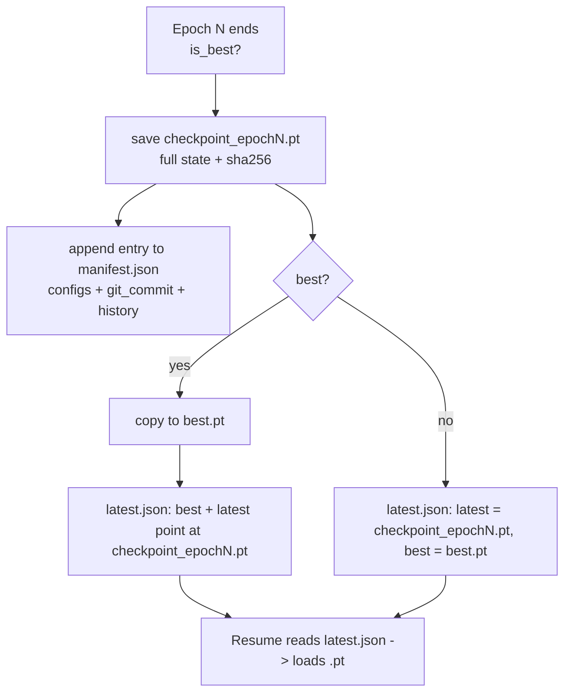

# Checkpoint Format — Teacher Encoder

Spec for the versioned checkpoint layout written by `CheckpointManager`
(`src/training/checkpoint.py`) under
`models/foundation/teacher_v1/<run_id>/`.



## 1. Directory layout

```
models/foundation/teacher_v1/<run_id>/
├── checkpoint_epoch1.pt ... checkpoint_epochN.pt   # one per saved epoch
├── best.pt                                          # copy of the best-val-loss epoch
├── latest.json                                      # pointer file (resume target)
└── manifest.json                                    # run metadata + history (append-only)
```

- `run_id` = `YYYYMMDD_HHMMSS_{smoke|full}` (the suffix is `smoke` for
  `--smoke` runs, `full` otherwise).
- The **directory name is the run identity**; everything else is derived from
  `manifest.json`.

## 2. `checkpoint_epochN.pt` — the full state dict

Saved with `torch.save(state, ...)` and loaded with
`torch.load(path, map_location="cpu", weights_only=True)`. Top-level keys:

| Key | Type | Content |
|---|---|---|
| `epoch` | int | epoch this checkpoint ended at (1-based) |
| `step` | int | global step count at save time |
| `model_state` | dict | `TeacherEncoder.state_dict()` |
| `optimizer_state` | dict | AdamW `state_dict()` |
| `scheduler_state` | dict \| None | warmup+cosine `LambdaLR` state |
| `normalizer_state` | dict | fitted `FeatureNormalizer` state (`mode` + per-feature stats) |
| `mask_generator_state` | dict | train `MaskGenerator` RNG state (resume continuity) |
| `val_mask_generator_state` | dict \| None | validation `MaskGenerator` state (fixed per run) |
| `train_loss` | float \| None | train loss at save |
| `val_loss` | float \| None | val loss at save |
| `metrics` | dict \| None | per-group breakdown `{train:{price,funding_oi,calendar}, val:{...}}` |

Size reference: a smoke checkpoint (`d_model 128`, 2 layers) ≈ 5.6 MB; a full
model (`d_model 512`, 8 layers) is ~20× larger.

## 3. `latest.json` — resume pointer

```json
{ "best": "checkpoint_epoch1.pt", "latest": "checkpoint_epoch1.pt" }
```

- Written on every save. `latest` = most recent checkpoint, `best` = best-val
  epoch.
- After a non-best save: `"latest": "checkpoint_epochN.pt"`, `"best": "best.pt"`.
- After a best save: both point at `checkpoint_epochN.pt`.
- Resume loads whatever `latest` points at.

## 4. `manifest.json` — the run's single source of truth

```json
{
  "run_id": "20260801_214517_smoke",
  "configs": { "model_config": {...}, "optimizer_config": {...}, "trainer_config": {...} },
  "git_commit": "d5dda35a5f7557a3c369c4ecb8473050eb55783d",
  "checkpoints": [
    {
      "epoch": 1,
      "step": 64,
      "path": "checkpoint_epoch1.pt",
      "sha256": "80b5217e0e310a2d",
      "train_loss": 2.023525459691882,
      "val_loss": 2.806509792804718,
      "metrics": { "train": {...}, "val": {...} }
    }
  ]
}
```

Semantics:

- `configs` holds the **verbatim, fully-resolved** model/optimizer/trainer
  configs used for the run. On resume this section is authoritative and the CLI
  configs are ignored (see `TRAINING_GUIDE.md` §5). Evaluation modules read the
  same section to rebuild the model, dataset, and normalizer identically
  (`_common.py::load_checkpoint_config`).
- `git_commit` is captured from `git rev-parse HEAD` at save time (`unknown`
  if git is unavailable) — reproducibility anchor.
- `checkpoints` is append-only: resuming loads the prior history so new saves
  append rather than overwrite.
- `sha256` is the first 16 hex chars of the file hash, written immediately
  after each save.

## 5. Resume mechanics

1. `CheckpointManager` loads `manifest.json`, restores `history`.
2. `latest.json` selects the checkpoint: `latest` key, falling back to `best`.
3. `_load` restores model weights, optimizer state, scheduler state, normalizer
   state, and both mask generators; the trainer continues at `(epoch, step)`.
4. New saves append to the restored history.

If the resume checkpoint fails to load, the trainer **warns and starts fresh**
rather than crashing.

## 6. Compatibility rules

- A checkpoint is only valid for the **exact model architecture + feature
  layout** recorded in its `manifest.json` `configs`. Do not point eval/train
  at a checkpoint with mismatched `d_model`/`feature_dim`/`context_length`.
- `latest.json` is trivial to regenerate; `manifest.json` + `.pt` files are the
  durable artifacts. Keep the whole `<run_id>/` directory together.
- `best.pt` may be missing if only a non-best epoch was saved; eval tools fall
  back to the newest `checkpoint_epoch*.pt` (see `_resolve_checkpoint_path`).
