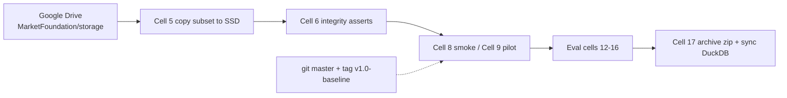

# Colab Guide — Managed GPU Training

Cell-by-cell walkthrough of `colab_training.ipynb`, the runnable version of
this project for a managed GPU (Google Colab). Read `GPU_TRAINING_GUIDE.md`
first for the underlying concepts; this guide is specific to the notebook.

## 0. Big picture

The notebook runs in `/content/emptyu` (REPO), keeps the **frozen dataset on
Google Drive** (`MarketFoundation/storage/`), copies just the futures 1m subset
(~300 files, ~160 MB) to the Colab local SSD, symlinks outputs back to Drive,
trains with the standard CLI, and archives results. Cell 2 checks out
`master` (so `RESEARCH_BASELINE.md` and the guides ship with the run); the
`v1.0-baseline` git tag stays the immutable release anchor, and the run's
`git_commit` is recorded in each manifest. The dataset fingerprint
`328a7b67...b5ae3875` is asserted in Cell 6.

## 1. Cell map (18 cells)

| Cell | What it does | If it fails |
|---|---|---|
| 1 | GPU info: `torch.cuda.is_available()`, device name | no GPU → wrong runtime (enable GPU accelerator) |
| 2 | Clone `https://github.com/sandeep999-cyber/emptyu.git`, checkout `master` | network/auth → fix git URL/credential |
| 2b | `git rev-parse HEAD` + `git describe --tags` + `git status --short` | clean tree expected; `describe` shows tag + commit count |
| 3 | `pip install -r requirements.txt` | see `TROUBLESHOOTING.md` §deps |
| 3b | Fail-fast CUDA assert (pip may have replaced torch with CPU wheel) | reinstall CUDA torch (Cell 3b prints the command) |
| 4 | Mount Google Drive (`drive.mount("/content/drive")`) | authorize in popup |
| 4b | Locate storage: sets `DRIVE_BASE`, `DRIVE_STORAGE`, `REPO` | wrong path → set `DRIVE_STORAGE` to `.../MarketFoundation/storage` |
| 5 | Copy `storage/training` + canonical futures 1m subset BTC/ETH/SOL to SSD; symlink `models/`, `logs/`, `evaluation/` to Drive | disk space |
| 6 | Integrity: assert fingerprint == `328a7b67...`, file_count == 510, manifest splits, DuckDB opens, one parquet reads | fingerprint mismatch → dataset version differs |
| 7 | Verify snapshot present under `storage/training/snapshots/` | copy snapshot from Drive |
| 8 | Smoke test: `train_teacher --smoke` (CPU-ok) | follow `TRAINING_GUIDE.md` §3 |
| 8b | Print experiment summary (fingerprint, snapshot, splits, commit, tag) | — |
| 9 | **Pilot training** (full config, CUDA). Warns about disconnects; checkpoints every epoch | interrupted → Cell 10 resume |
| 10 | Resume: uncomment, fill `<RUN_ID>` → `--resume models/foundation/teacher_v1/<RUN_ID>` | see `GPU_TRAINING_GUIDE.md` §5 |
| 11 | Find latest checkpoint dir, sets `CHECKPOINT_DIR` env | no checkpoints → train first |
| 12 | Clustering eval (uses `$CHECKPOINT_DIR`) | see `EVALUATION_GUIDE.md` §3.1 |
| 13 | Retrieval eval | §3.2 |
| 14 | Temporal consistency eval | §3.4 |
| 15 | Linear probe for `cls`, `mean`, `attention` pooling | §3.3 |
| 16 | Visualization (PCA + loss curves) | §3.5 |
| 17 | Archive `evaluation/` → `phase2_results.zip` on Drive; copy updated `index.duckdb` + `experiment_registry.duckdb` back to Drive | — |
| optional | `pip freeze > environment.txt`, `nvidia-smi` | — |

## 2. Colab-specific behaviors to know

- **Disconnects are expected.** Checkpoints are written every epoch and model
  dir is symlinked to Drive, so reconnect → Cell 10 → resume is always safe.
- **num_workers:** the trainer's `num_workers` is adapted to Colab's 2-core
  CPU (high values deadlock/stall on Colab). Leave as configured in the
  trainer defaults.
- **Write reliability:** DuckDB files are copied to local SSD (Cell 5) and
  synced back only at the end (Cell 17), because writing SQLite/DuckDB
  directly on Drive is flaky. Do not kill the kernel before Cell 17 finishes.
- **`$CHECKPOINT_DIR`** is set as an env var by Cell 11; the eval cells read it.
  After resuming, re-run Cell 11 so it points at the right run dir.

## 3. Getting results off the VM

- Cell 17 writes `phase2_results.zip` to `DRIVE_BASE` and syncs the two DuckDB
  files to `DRIVE_STORAGE/training/`.
- The `models/` and `evaluation/` symlinks land under Drive too — checkpoints
  and eval JSONs are persisted even if the VM resets.

## 4. Recommended session order

1. Cells 1 → 7 (setup + integrity). Re-running the notebook on a fresh VM is
   idempotent (Cell 5 wipes and re-copies).
2. Cell 8 (smoke) — confirm the pipeline before committing GPU hours.
3. Cell 9 (pilot). If disconnect, Cell 10 resume. Repeat until 10 epochs.
4. Cells 11 → 16 (evaluation). Read results per `EVALUATION_GUIDE.md`.
5. Cell 17 (archive + sync) — always run before session end.

## 5. Reproducibility within Colab

The notebook enforces the same anchors as anywhere else: checkout of `master`
(with `v1.0-baseline` as the immutable release anchor — see `RESEARCH_BASELINE.md`),
fingerprint assert, manifest asserts, seed 42 in configs. Record the GPU model
and torch version (Cell 1 / optional env snapshot) — cross-GPU numeric noise is
expected (see `REPRODUCIBILITY.md` §4).
