# Data Flow — From Binance Archive to Model Tensor

This document traces every byte from the Binance Vision download to the
`MarketDataset` tensors the Phase 2 model consumes, with the exact CLI, the
storage layout, the schemas, and the provenance attached along the way.

```mermaid
flowchart LR
    subgraph Acquire
        A1[main.py download] --> A2[(storage/raw ZIPs + .checksum)]
    end
    subgraph Canonicalize
        A2 --> B1[main.py convert]
        B1 --> B2[(storage/canonical ... 1m.parquet)]
        B2 --> C1[main.py resample]
        C1 --> C2[(canonical 5m/15m/1h/4h/1d)]
    end
    subgraph Index
        B2 --> D1[main.py build-lake]
        C2 --> D1
        D1 --> D2[(calendar + metadata + index.duckdb)]
    end
    subgraph Verify
        D2 --> E1[main.py validate]
        D2 --> E2[main.py quality-report]
    end
    subgraph Freeze
        E1 --> F1[main.py snapshot]
        F1 --> F2[(training_manifest_v1.json + dataset_fingerprint.json + snapshots/)]
    end
    subgraph Consume
        F2 --> G1[lake.market_state]
        G1 --> G2[feature_builder.build_features]
        G2 --> G3[WindowingEngine]
        G3 --> G4[MarketDataset]
        G4 --> G5[Training / Evaluation]
    end
```



## 1. Stage-by-stage

All Phase 1 stages are driven by `python main.py <subcommand>` and are
deterministic given the same inputs. Each stage records an entry in
`storage/training/pipeline_manifest_v1.json` (inputs, outputs, checksums,
duration).

### 1.1 `download` — acquire raw archives

```bash
python main.py download --symbols BTCUSDT,ETHUSDT,SOLUSDT --market futures --start-year 2024 --limit-months 12
```

- Fetches `exchangeInfo` from the REST API (futures `fapi.binance.com` /
  spot `api.binance.com`) and registers asset metadata in the DuckDB
  `asset_registry` (append-only with `valid_from`/`valid_to`).
- Archives each symbol's `exchange_info/<year>.json`.
- Downloads monthly ZIPs from `https://data.binance.vision/data` for every
  dataset type listed in `download.yaml` (`datasets:`), plus each `.zip.checksum`,
  and **deletes any ZIP whose SHA256 does not match** the published checksum.
- Non-200/non-404 responses are treated as errors (never written to disk).
- Output: `storage/raw/{market}/{symbol}/{dataset_type}[/1m]/` files.

Raw layout (from `binance_vision.py` and `main.py`):

```
storage/raw/futures/BTCUSDT/klines/1m/BTCUSDT-1m-2024-01.zip
storage/raw/futures/BTCUSDT/funding/BTCUSDT-fundingRate-2024-01.zip
storage/raw/futures/BTCUSDT/open_interest/BTCUSDT-metrics-2024-01.zip
storage/raw/futures/BTCUSDT/aggTrades/BTCUSDT-aggTrades-2024-01.zip   # if enabled
```

### 1.2 `convert` — raw ZIP → canonical Snappy Parquet

```bash
python main.py convert --symbols BTCUSDT,ETHUSDT,SOLUSDT --market futures --start-year 2024 --limit-months 12 --download-date 2026-07-30
```

- Extracts the CSV, detects the header (robust against headerless files),
  normalizes timestamps to **epoch milliseconds**, sorts, and writes a Snappy
  Parquet.
- **Embeds provenance** in every Parquet file's schema metadata:

  ```json
  {
    "provenance_created_by": "parquet_converter.py",
    "provenance_source": "binance_vision_archive",
    "provenance_source_checksum": "sha256:<zip sha256>",
    "provenance_download_date": "2026-07-30",
    "provenance_converter_version": "v1",
    "provenance_alignment_version": "alignment_v1.yaml",
    "provenance_schema_version": "canonical_schema_v1",
    "provenance_snapshot": "2026-07-30"
  }
  ```

- Registers each file in DuckDB `file_index_v1` (file_id, symbol, market,
  dataset_type, interval, year, month, start/end ts, row_count, file_size,
  sha256, schema_hash, file_path, status=`CONVERTED`).
- Column remapping to canonical names is defined per dataset type in
  `parquet_converter.py::BINANCE_CSV_SCHEMAS` (e.g. klines
  `open_time→timestamp`, funding `last_funding_rate→funding_rate`,
  `calc_time→timestamp`).

### 1.3 `resample` — 1m → 5m / 15m / 1h / 4h / 1d

```bash
python main.py resample --symbols BTCUSDT --market futures --start-year 2024 --limit-months 12
```

- Aggregates 1m klines via DuckDB SQL into the target intervals
  (open = FIRST, high = MAX, low = MIN, close = LAST, sums for volume/quote/
  count/taker fields, plus `constituent_count`).
- Candles with fewer 1m constituents than expected are flagged:
  status `RESAMPLED_INCOMPLETE` (a warning is emitted but candles are kept).
- Output: `storage/canonical/{market}/{symbol}/klines/{interval}/{year}-{mm}.parquet`.
- Provenance records the source file + its SHA256 + target interval.

### 1.4 `align` — report causal alignment coverage

```bash
python main.py align --symbols BTCUSDT --market futures
```

- Runs `lake.market_state()` and prints per-symbol aligned row counts and
  funding/OI coverage. This is a **report** stage; the real alignment happens
  lazily inside `lake.market_state`.

### 1.5 `build-lake` — calendar, metadata, and Data Lake views

```bash
python main.py build-lake --symbols BTCUSDT --market futures --year 2024
```

- Generates `calendar_{year}_v1.parquet` (full-year 1-minute temporal matrix:
  `minute_of_day, hour, day_of_week, day_of_month, month, quarter, year,
  is_weekend`), registered in the index with status `GENERATED`.
- Writes per-symbol metadata into `storage/canonical/{market}/{symbol}/metadata/`:
  - `dataset_version.json`
  - `statistics_v1.json` (min/max/mean/std per numeric column)
  - a copy of `market_state_schema_v1.json`
  - `DATASET.md` (per-symbol data card)

### 1.6 `validate` — SHA256 integrity + modality rules

```bash
python main.py validate
python main.py validate --symbol BTCUSDT --market futures --type klines
```

- Verifies every indexed file's SHA256 against `file_index_v1`.
- `validator.py` enforces the rules in `validation.yaml` (e.g. klines
  high ≥ low, close > 0; funding monotonic/no missing; timestamps strictly
  increasing, max gap 300 s). Exits non-zero on any failure.

### 1.7 `quality-report` — per-symbol `quality_report.json`

```bash
python main.py quality-report --symbols BTCUSDT
```

- Computes: missing values per modality, forward-fill %, alignment coverage,
  duplicate rows, gap count/largest gap, incomplete-history flags,
  resampling statistics, and a `quality_score` (100 minus penalties).
- Written to `storage/canonical/{market}/{symbol}/metadata/quality_report.json`.

### 1.8 `snapshot` — freeze the dataset

```bash
python main.py snapshot --date 2026-07-30
```

- Builds `training_manifest_v1.json` from `file_index_v1` (splits + version
  pins + `file_ledger` SHA256 map + seeds).
- Writes it to `storage/training/training_manifest_v1.json` and
  `storage/training/dataset_fingerprint.json` (SHA256 over the sorted ledger +
  version pins).
- Creates `storage/training/snapshots/<date>/{manifest.json, checksums.json,
  stats.json, content_hash}`. **Re-creating the same date raises
  `FileExistsError`.**
- See `REPRODUCIBILITY.md` for the full semantics.

### 1.9 `report` — storage summary

```bash
python main.py report
```

- Writes `storage/training/storage_summary.md` (file counts, rows, sizes).

### 1.10 `benchmark` — DataLoader throughput

```bash
python main.py benchmark --symbols BTCUSDT
python -m src.training.benchmark --snapshot 2026-07-30 --symbols BTCUSDT
```

- Measures samples/sec, batches/sec, latency, MB/sec, RAM delta, CPU %.

## 2. The consume path (what the model actually reads)

The training and evaluation code never reads raw or canonical files directly.
They call the Data Lake:

```
lake.market_state(symbol, market="futures")            # aligned DataFrame
  → alignment_engine.align_symbol_data(...)            # causal alignment
feature_builder.build_features(df_state, style="raw")  # [N,15] float32 + mask + ts
WindowingEngine(...).create_windows(...)               # list of window dicts
MarketDataset(windows)                                  # PyTorch Dataset
```

### 2.1 `lake.market_state` (src/data/lake.py)

- Reads klines 1m, funding, open_interest, and calendar Parquets with SQL
  filter pushdown (`timestamp` range) into an in-memory DuckDB.
- Applies an **8-hour lookback** on funding/OI reads so forward-fill is valid
  at the earliest requested minute.
- Hands the four frames to `AlignmentEngine.align_symbol_data`, which:
  - sorts on `timestamp`, applies `shift_to_known_at` (klines → `close_time`),
  - **forward-fills** funding (8h) and open_interest (5m) via
    `merge_asof(direction="backward")`, flagging values older than the
    modality's frequency as `<value>_stale`,
  - derives calendar fields inline (or merges the prebuilt calendar).
- Raises `NotImplementedError` if agg_trades/depth/liquidations are passed
  (declared but inactive in `alignment_v1.yaml`).

### 2.2 `feature_builder.build_features` (src/data/feature_builder.py)

Two styles, same 15-dim layout:

| idx | raw | returns |
|---|---|---|
| 0 | open | log_return |
| 1 | high | hl_range |
| 2 | low | oc_body |
| 3 | close | log_volume |
| 4 | volume | volume_change |
| 5 | funding_rate | funding_rate |
| 6 | open_interest | log1p(open_interest) |
| 7–14 | calendar | calendar (input only) |

- `feature_mask[i] = observed`, NaN → 0 (numeric safety only).
- `_stale` funding/OI are masked as unobserved (input context, not targets).
- Style is recorded per run in the checkpoint `manifest.json`; evaluation and
  baselines read it back so metrics stay comparable.

### 2.3 `WindowingEngine` (src/data/windowing.py)

- Cuts into `sequence_length=512` windows at `stride` (frozen `windowing_v1.yaml`
  says stride 1; the trainer builds directly at a configurable stride to save RAM).
- Rejects windows with a timestamp gap > `max_gap_ms` (300 s default), or with
  duplicate/out-of-order timestamps (raises `ValueError`).
- Per-position `mask`: invalid if **all** features unobserved or if the next
  gap exceeds twice the expected step.

### 2.4 `MarketDataset` (src/data/market_dataset.py)

- Thin wrapper: converts numpy windows to torch tensors. **Never engineers,
  never cuts** — the philosophy in code.

### 2.5 Tensor shapes through training

```
batch["features"]      [B, 512, 15] float32   (normalized)
batch["feature_mask"]  [B, 512, 15] bool
batch["timestamps"]    [B, 512]     int64 (epoch ms)
batch["mask"]          [B, 512]     bool   (per-timestep validity)
→ mask 15% data positions
→ TeacherEncoder: project [B,512,15]→[B,512,512], prepend CLS → [B,513,512],
  RoPE(time-aware), 8 blocks → latent [B,513,512]
→ reconstruct data latents [B,512,512] → {price [B,512,5], funding_oi [B,512,2],
  calendar {field: [B,512,classes]}}
→ loss over masked positions only
```

## 3. End-to-end worked example

```bash
# 0. Install
pip install -r requirements.txt

# 1. Build the dataset (Phase 1)
python main.py download --symbols BTCUSDT,ETHUSDT,SOLUSDT --market futures --start-year 2024 --limit-months 12
python main.py convert  --symbols BTCUSDT,ETHUSDT,SOLUSDT --market futures --start-year 2024 --limit-months 12
python main.py resample --symbols BTCUSDT,ETHUSDT,SOLUSDT --market futures --start-year 2024 --limit-months 12
python main.py build-lake --symbols BTCUSDT,ETHUSDT,SOLUSDT --market futures --year 2024
python main.py validate
python main.py quality-report --symbols BTCUSDT,ETHUSDT,SOLUSDT
python main.py snapshot --date 2026-07-30
python main.py report

# 2. Sanity-check data throughput (Phase 1)
python main.py benchmark --symbols BTCUSDT

# 3. Train the teacher (Phase 2) — see TRAINING_GUIDE.md
python -m src.training.train_teacher --smoke
python -m src.training.train_teacher \
  --model-config configs/model_v1.yaml \
  --optimizer-config configs/optimizer_v1.yaml \
  --trainer-config configs/trainer_v1.yaml

# 4. Evaluate — see EVALUATION_GUIDE.md
```

## 4. Provenance summary

| Artifact | What identifies its origin |
|---|---|
| Raw ZIP | Binance `.checksum` (verified at download) |
| Canonical Parquet | embedded `provenance_*` schema metadata (source sha256, download date, versions) |
| Resampled Parquet | `provenance_source_file` + source sha256 + interval |
| Calendar Parquet | deterministic `provenance_row_hash` |
| Dataset | `dataset_fingerprint.json` (SHA256 over file ledger + version pins) |
| Training run | `manifest.json` (configs verbatim + git commit + checkpoint hashes) |
