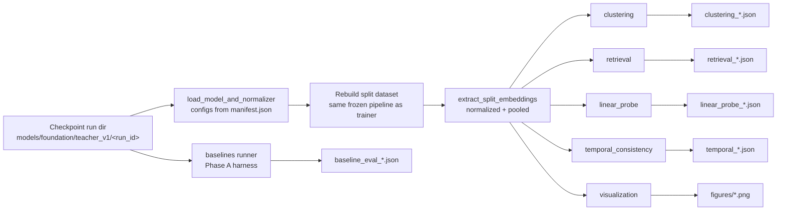

# Evaluation Guide — Phase 2 Teacher Encoder

This guide covers every evaluation path in the repo: embedding extraction,
the five frozen-encoder probes, and the Phase-A baseline harness. It explains
exactly what each command does, what it writes, and how to read the numbers.



## 1. What is evaluated (and what is NOT)

Everything here evaluates the **frozen teacher encoder** (no fine-tuning, no
backprop): it extracts pooled embeddings from a checkpoint and measures what
they already encode. The Phase-A harness (`baselines/`) additionally compares
these embeddings against cheap baselines (majority, persistence, raw linear,
handcrafted linear, random projections) so any claim about the encoder is read
relative to a reference, not in a vacuum.

Leakage protocol (enforced by `_common.py` and `runner.py`):

- Splits come from the **frozen manifest**: train = BTCUSDT+ETHUSDT capped at
  `train_end` (2024-11-30); validation = SOLUSDT (held-out symbol, unbounded in
  time); test = BTCUSDT+ETHUSDT starting at `train_end`.
- The normalizer is **loaded from the checkpoint** (fit on train symbols only)
  and applied identically at eval time — never refit.
- In the baselines harness, fit windows end at least `horizon_min` before the
  eval start, so no fit label uses eval-period data; thresholds/scalers/
  classifiers are fit on the fit split only.
- The probe thresholds come from the **train split only** (`linear_probe.py`
  `_labels_from_stats`).

## 2. Embedding extraction + pooling

All five embedding CLIs share the same pipeline (`_common.py`):

1. Read `manifest.json` from the run dir for the exact model/optimizer/trainer
   configs.
2. Resolve the checkpoint: `best.pt` via `latest.json` (falls back to newest
   `checkpoint_epoch*.pt`).
3. Rebuild the split dataset through the same frozen windowing/normalization
   pipeline the trainer uses.
4. Run `src.models.teacher.embeddings.extract_embeddings(model, loader, pooling)`.

Pooling modes (`--pooling`, choices `cls` | `mean` | `attention`):

- `cls` — the CLS token output at position 0 (see `RESEARCH_PHILOSOPHY.md`
  §masking: the CLS seam is never corrupted).
- `mean` — mean-pool over all time tokens (default everywhere).
- `attention` — attention-weighted pooling over the untrained attention pooler.

## 3. The five embedding probes

All take `--checkpoint <run_dir>` (required), `--pooling`, `--max-windows`
(optional cap). Outputs are JSON under `evaluation/embedding/` (git-ignored,
regenerable) and figures under `evaluation/embedding/figures/`.

### 3.1 Clustering — `clustering.py`

KMeans on pooled embeddings; measures whether embeddings separate market
regimes into natural clusters.

```bash
python -m src.evaluation.embedding.clustering \
  --checkpoint models/foundation/teacher_v1/<run_id> \
  --split train --pooling mean --clusters 8
```

Writes `evaluation/embedding/clustering_<split>_<pooling>.json` with `n_samples`,
`silhouette`, `inertia`, and cluster-size distribution. Read `silhouette` in
`[-1, 1]`; positive values mean the model found regimes the labels didn't
provide (no-label thesis check).

### 3.2 Retrieval — `retrieval.py`

Nearest-neighbor self-retrieval (kNN on the embeddings): are similar market
states near each other?

```bash
python -m src.evaluation.embedding.retrieval \
  --checkpoint models/foundation/teacher_v1/<run_id> \
  --split validation --pooling mean --k 10
```

Writes `evaluation/embedding/retrieval_<split>_<pooling>.json` with mean top-k
reciprocal rank / neighbor-cosine metrics. Higher = temporally-coherent
structure.

### 3.3 Linear probe — `linear_probe.py`

Trains tiny logistic-regression heads on frozen embeddings for window
pseudo-labels (volatility bucket, range expansion, liquidity regime) derived
from raw window features. Thresholds computed on the **train split only**, then
applied to the held-out cross-symbol split (SOL) and to in-sample (train).

```bash
python -m src.evaluation.embedding.linear_probe \
  --checkpoint models/foundation/teacher_v1/<run_id> --pooling mean
```

Writes `evaluation/embedding/linear_probe_<pooling>.json`. Read:

```json
{
  "probes": {
    "volatility": {
      "cross_symbol_bacc": 0.5,     // SOL held-out balanced accuracy
      "in_sample_bacc": 0.8672,     // train-symbol balanced accuracy
      "majority_baseline": 0.1094   // trivial majority accuracy on SOL
    }
  }
}
```

Cross-symbol bacc **above** the majority baseline = the encoder generalizes
pseudo-property structure to a symbol it never saw at train time. Baseline
numbers for this pilot are deliberately weak (tiny probe, few windows), which
is expected — see `MODEL_CARD.md`.

### 3.4 Temporal consistency — `temporal_consistency.py`

Quantifies whether embeddings change smoothly over time (cosine similarity
between consecutive windows) versus random pairs.

```bash
python -m src.evaluation.embedding.temporal_consistency \
  --checkpoint models/foundation/teacher_v1/<run_id> \
  --split validation --pooling mean
```

Writes `evaluation/embedding/temporal_<split>_<pooling>.json` (adjacent cosine
vs. random-pair cosine). Adjacent >> random = temporally ordered, non-jumpy
representations.

### 3.5 Visualization — `visualization.py`

Loss curves (read from the run manifest history) + 2-D projection of pooled
embeddings colored by time/regime.

```bash
python -m src.evaluation.embedding.visualization \
  --checkpoint models/foundation/teacher_v1/<run_id> --method pca --pooling mean
```

Writes `evaluation/embedding/figures/loss_curves.png` and
`evaluation/embedding/figures/<method>_<split>_<pooling>.png`.

## 4. Baseline harness — `src.evaluation.baselines.runner`

Causally-separated, labeled windows; fits simple baselines on the fit split
and reports bacc/acc/AUC for `future_return`, `volatility`, `range_expansion`,
`liquidity` on temporal + cross-symbol eval. With `--checkpoint`, the exact
same windows are embedded and scored as an additional representation.

```bash
# Baselines only (no checkpoint)
python -m src.evaluation.baselines.runner

# With frozen embeddings from a checkpoint
python -m src.evaluation.baselines.runner \
  --checkpoint models/foundation/teacher_v1/<run_id> --pooling mean
```

Flags (all have sensible defaults): `--market futures`, `--fit-symbols
BTCUSDT,ETHUSDT`, `--fit-start/--fit-end` (default 2024-01-01 → 2024-11-30,
exclusive), `--eval-symbols BTCUSDT,ETHUSDT,SOLUSDT`, `--eval-start/--eval-end`
(default 2024-12-01 → 2024-12-31), `--seq-len 512`, `--stride 16`,
`--horizon-min 15`, `--max-windows 1500` (per-symbol cap; null = unlimited),
`--seed 42`, `--feature-style raw|returns`, `--batch-size 32`,
`--out evaluation/baselines`.

When `--checkpoint` is given, `--seq-len` is overridden to the model's
`context_length` and `--feature-style` defaults to the checkpoint's style (with
a warning if you force a mismatch). Writes
`evaluation/baselines/baseline_eval_<timestamp>.json`.

How to read a report (example: `baseline_eval_20260801_215055.json`, smoke
checkpoint, `mean` pooling):

| Task | Majority bacc | Persistence bacc | Raw-linear bacc | Handcrafted bacc | **Embedding bacc** |
|---|---|---|---|---|---|
| future_return | 0.5 | 0.5089 | 0.4952 | 0.5053 | 0.5016 |
| volatility | 0.5 | — | 0.9561 | 0.9912 | **0.9558** |
| range_expansion | 0.5 | — | 0.9297 | 0.9966 | **0.9488** |
| liquidity | 0.5 | — | 0.7597 | 0.9966 | **0.5896** |

Reading rules:

- `future_return` ≈ 0.5 everywhere (including the embedding) = the model has
  **not** learned return direction — as designed (no-label MMM thesis). Any
  future_return bacc meaningfully above 0.5 would be a red flag / leak.
- volatility/range/liquidity: embeddings beat majority and raw-linear, trail
  handcrafted — the pilot smoke model encodes regime structure but the tiny
  handcrafted feature set is still the easiest linear read. Trend to watch as
  model size / data grow: does the gap to handcrafted close?
- `config` block at the bottom records exactly what was evaluated (checkpoint,
  pooling, split windows, seed) → each JSON is self-describing and
  reproducible.

## 5. Worked end-to-end example

```bash
# Train (smoke or full) first — see TRAINING_GUIDE.md
RUN=models/foundation/teacher_v1/20260801_214517_smoke

python -m src.evaluation.embedding.clustering --checkpoint $RUN --split train --pooling mean
python -m src.evaluation.embedding.retrieval --checkpoint $RUN --split validation --pooling mean
python -m src.evaluation.embedding.linear_probe --checkpoint $RUN --pooling mean
python -m src.evaluation.embedding.temporal_consistency --checkpoint $RUN --split validation --pooling mean
python -m src.evaluation.embedding.visualization --checkpoint $RUN --method pca --pooling mean
python -m src.evaluation.baselines.runner --checkpoint $RUN --pooling mean
```

## 6. Where results live (all git-ignored)

| Artifact | Path |
|---|---|
| Embedding probe JSONs | `evaluation/embedding/*.json` |
| Figures | `evaluation/embedding/figures/*.png` |
| Baseline reports | `evaluation/baselines/baseline_eval_*.json` |

They are excluded from git (`MODEL_CARD.md` / `REPRODUCIBILITY.md` show how to
re-derive them from a checkpoint).
