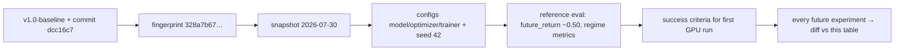

# Research Baseline — First GPU Experiment (Ground Truth)

> **Status: FROZEN.** This file is the ground truth for the first full-scale
> GPU experiment. It is not implementation documentation — it pins the exact
> data, code, configuration, and reference numbers every future experiment is
> compared against. Do not edit this file casually; change it only via a
> deliberate re-baselining decision (see §8).

## 1. Code identity

| Anchor | Value |
|---|---|
| Git tag | `v1.0-baseline` |
| Git commit (full) | `dcc16c758c2d247eaeac72afdbf6ebd5e36760a3` |
| Short | `dcc16c7` |
| Branch | `master` |
| Test suite | 203 tests passing |

## 2. Data identity

| Anchor | Value |
|---|---|
| Dataset fingerprint | `328a7b67b070b95e47ba450452032a93dfa410431e0cf329de6a4ac7b5ae3875` |
| File count | 510 |
| Snapshot ID | `2026-07-30` |
| Canonical schema version | v1 |
| Market state schema | `market_state_schema_v1.json` (15-dim) |
| Alignment contract | `alignment_v1.yaml` |
| Modality registry | `modalities_v1.yaml` |
| Feature builder | v1 (`feature_builder.py`, styles `raw` / `returns`) |
| Windowing | `windowing_v1.yaml` |

## 3. Train / validation / test split

Frozen in `storage/training/training_manifest_v1.json`:

| Split | Symbols | Time bounds |
|---|---|---|
| Train | BTCUSDT, ETHUSDT | windows capped at `train_end` = **2024-11-30** |
| Validation | **SOLUSDT** (held-out symbol, never trained on) | unbounded in time |
| Test | BTCUSDT, ETHUSDT | starts at `train_end` (2024-12-01 onward) |

Evaluation protocol respects this causality: normalizer fit on train symbols
only; probe thresholds from train only; baseline harness fit windows end at
least `horizon_min` before eval start.

## 4. Model configuration

Primary config: `configs/model_v1.yaml` (`teacher_transformer_v1`).

| Parameter | Value |
|---|---|
| `d_model` | 512 |
| `n_layers` | 8 |
| `n_heads` | 8 |
| `d_ff` | 2048 |
| `dropout` | 0.1 |
| `context_length` | 512 (1-minute steps) |
| `feature_dim` | 15 |
| `cls_token` | true |
| `rope_theta` | 10000.0 |
| Pooling heads | `[cls, mean, attention]` (default eval pooling: `mean`) |

Returns/span-mask variant: `configs/model_returns_v1.yaml` (same architecture;
`feature_style: returns`).

## 5. Loss configuration

| Group | Feature indices | Loss | Weight |
|---|---|---|---|
| price | 0-4 (OHLC, close, volume) | Huber | 1.0 |
| funding_oi | 5-6 (funding_rate, open_interest) | MSE | 1.0 |
| calendar | 7-14 (8 calendar fields) | Cross-entropy | 1.0 |

- `mask_ratio` = **0.15** over valid data positions; the CLS seam (position 0)
  is never masked.
- Raw variant: random-position masking, calendar reconstructed.
- Returns variant: contiguous-span masking (`mask_mode: span`, `span_len:
  16`); calendar kept as input but **excluded** from the reconstruction target
  (`reconstruct_calendar: false`).

## 6. Optimizer & scheduler configuration

`configs/optimizer_v1.yaml`:

| Parameter | Value |
|---|---|
| Optimizer | AdamW |
| `lr` | 3e-4 |
| `weight_decay` | 0.01 |
| `betas` | (0.9, 0.999) |
| `eps` | 1e-8 |
| `grad_clip` | 1.0 |
| Scheduler | warmup 5% + cosine decay |
| `lr_floor` | 1e-6 |

## 7. Random seed

| RNG | Seed |
|---|---|
| python | 42 |
| numpy | 42 |
| torch | 42 |
| Validation mask generator | `(42 + 10**6) & 0xFFFFFFFF` (fixed mask pattern per run) |

## 8. Reference baseline evaluation results

> Scope note: the numbers below come from the **smoke checkpoint**
> `models/foundation/teacher_v1/20260801_214517_smoke` (d_model 128, 2 layers,
> 4 heads) with `mean` pooling. They are the reference *metrics and protocol*;
> the first GPU experiment re-runs the exact same commands on the full model.
> Source artifacts: `evaluation/embedding/linear_probe_mean.json`,
> `evaluation/baselines/baseline_eval_20260801_215055.json`.

### 8.1 Linear probe (balanced accuracy)

| Probe | cross-symbol (SOL) | in-sample | majority baseline |
|---|---|---|---|
| volatility | 0.5 | 0.8672 | 0.1094 |
| range_expansion | 0.5 | 0.8594 | 0.0938 |
| liquidity | 1.0 | 0.9805 | 0.0 |

In-sample the encoder is readable; cross-symbol transfer to SOL is the open
question (volatility/range at 0.5 = chance in the smoke model; liquidity
already 1.0).

### 8.2 Baseline harness (eval 2024-12-01 → 2024-12-31; bacc)

| Task | Majority | Persistence | Raw linear | Handcrafted | **Embedding (mean)** |
|---|---|---|---|---|---|
| **future_return** | 0.5 | 0.5089 | 0.4952 | 0.5053 | **0.5016** |
| volatility | 0.5 | — | 0.9561 | 0.9912 | 0.9558 |
| range_expansion | 0.5 | — | 0.9297 | 0.9966 | 0.9488 |
| liquidity | 0.5 | — | 0.7597 | 0.9966 | 0.5896 |

### 8.3 The future-return benchmark (the ~0.50 anchor)

**`future_return` ≈ 0.50 (chance) across every representation** — majority 0.5,
persistence 0.5089, raw-linear 0.4952, handcrafted 0.5053, embedding 0.5016.
This is **by design**: the no-label MMM objective must not encode return
direction. A future experiment that shows `future_return` meaningfully above
chance (≳ 0.53 sustained, with AUC likewise) must be treated as a **leak or
implementation bug, not a signal** until investigated.

## 9. Success criteria — first GPU experiment

The first full-scale GPU run (full `d_model 512`, 10 epochs, `model_v1.yaml`,
seed 42, **effective** `batch_size 64` via `micro_batch_size 16` × grad-accum 4,
CUDA) passes when **all** of the following hold. Each is compared against §8.

| # | Criterion | Measure | Pass threshold |
|---|---|---|---|
| 1 | Pipeline validity | full run completes 10 epochs, no NaN, registry logged | `experiment_registry.duckdb` row exists; `val_loss` finite and non-increasing trend |
| 2 | No label leakage | `future_return` stays at chance | embedding `future_return` bacc ≤ **0.53** and AUC ≈ 0.5 (±0.02); persistence no higher than smoke (0.5089) |
| 3 | Cross-symbol transfer | linear-probe cross-symbol bacc on SOL | **> 0.5** for volatility and range_expansion (clears majority baseline 0.1094/0.0938); liquidity stays ≥ 0.5 |
| 4 | Regime encoding improves vs smoke | embedding bacc vs smoke (0.9558 / 0.9488 / 0.5896) | volatility ≥ 0.96, range_expansion ≥ 0.95, liquidity > 0.60 |
| 5 | Gap to handcrafted narrows | embedding vs handcrafted (0.9912 / 0.9966 / 0.9966) | gap (handcrafted − embedding) **≤ 0.03** per task |
| 6 | Convergence without divergence | `loss_curves.png` | train and val loss both descend; final val-loss gap to train is stable across last 2 epochs (no divergence) |
| 7 | Reproducibility anchors | fingerprint, commit, configs, seed | all match §1-§7 exactly; run `manifest.json` records the same `configs` + a `git_commit` reachable from `v1.0-baseline` |

Verdict rules:

- **PASS** — all 7 criteria met. Record the run as the new best and log it as
  an experiment row.
- **PARTIAL** — criteria 3-5 move the right direction but miss a threshold.
  Continue scaling (more data/epochs) before any architectural change.
- **FAIL** — criterion 2 trips (leak-like future_return) or criterion 7
  anchors mismatch. Stop, investigate (see `TROUBLESHOOTING.md`), and do not
  compare the run against this baseline until resolved.

## 10. How to use this baseline for every future experiment

1. Before any new experiment, verify anchors §1-§2 still match (`python
   main.py validate`).
2. Run the new experiment; keep its checkpoint run dir and eval JSONs.
3. Produce the same two comparison tables as §8.1 and §8.2 (same commands from
   `EVALUATION_GUIDE.md`, same pooling `mean`, same eval period defaults).
4. Diff against this file's tables row-by-row. Report: metrics changed,
   future_return unchanged-at-chance, anchors matched.
5. If any structural change is proposed (architecture, loss, features, split),
   it must first demonstrate improvement on the §8 tables **using the same
   frozen baseline protocol**; only then re-baseline.

## 11. Related

- `REPRODUCIBILITY.md` — the four anchors in depth.
- `MODEL_CARD.md` — model spec + current results.
- `EVALUATION_GUIDE.md` — exact commands that produce §8 tables.
- `GPU_TRAINING_GUIDE.md` — running the first GPU experiment.
