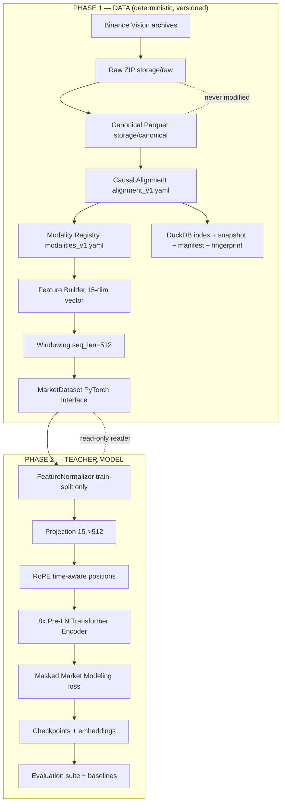

# System Overview — Pure Market Foundation Model

> Read this first. It explains what the repository is, the two phases, the
> layered architecture, where things live, and how the rest of the
> documentation fits together.

## 1. What this repository is

This repository builds and trains **self-supervised market foundation models**
on **raw, unengineered Binance historical market data**.

It is split into two phases that build on each other:

- **Phase 1 — Dataset Builder / Data Lake.** A deterministic, reproducible
  data platform that downloads Binance Vision archives, converts them to
  canonical Parquet, resamples, causally aligns every modality onto a shared
  1-minute timeline, fuses features, cuts windows, validates, fingerprints, and
  snapshots the result. **Phase 1 produces data, never models.**
- **Phase 2 — Teacher Foundation Model.** An encoder-only transformer trained
  with **Masked Market Modeling** (an SSL objective) on the frozen Phase 1
  data. **Phase 2 produces embeddings, never buy/sell signals.**

There is deliberately **no trading, no RL, no prediction head on the latent
path, and no hand-crafted technical indicators** anywhere in the system. Those
are explicit non-goals (see `RESEARCH_PHILOSOPHY.md`).

## 2. The layered pipeline



Key idea: **storage is richer than any encoder.** The data lake holds every
modality; a model declares which ones it wants through the versioned modality
registry. Phase progression (adding agg_trades, depth, liquidations) is a
*registry change*, not a *pipeline change*.

## 3. The 8 core principles (summary)

1. Raw data is immutable.
2. Canonical preserves exchange semantics.
3. Alignment is causal and versioned (no future leakage).
4. Storage is richer than any encoder.
5. No hand-crafted indicators.
6. Modalities are additive.
7. Models never modify datasets.
8. Every experiment is reproducible.

Full rationale: `RESEARCH_PHILOSOPHY.md` and `ARCHITECTURE.md` (which also
defines the four contracts: Raw, Canonical, Alignment, Model).

## 4. The two command surfaces

| Surface | Command | What it does |
|---|---|---|
| Phase 1 CLI | `python main.py <subcommand>` | download, convert, resample, align, build-lake, validate, quality-report, snapshot, report, benchmark |
| Phase 2 training | `python -m src.training.train_teacher` | train / smoke-test / resume the teacher model |
| Phase 2 evaluation | `python -m src.evaluation.embedding.<module>` | clustering, retrieval, linear_probe, temporal_consistency, visualization |
| Baselines | `python -m src.evaluation.baselines.runner` | classical baselines vs embeddings on downstream tasks |
| Tests | `python -m pytest tests/ -v` | 203 tests (verified) |

Every command in the table above has an example in `DATA_FLOW.md`,
`TRAINING_GUIDE.md`, or `EVALUATION_GUIDE.md`.

## 5. Repository map

```
D:\emptyu\
├── README.md                        # Entry point, quickstart, tests
├── ARCHITECTURE.md                  # 8 principles + 4 contracts
├── DATASET.md                       # Global HF-style dataset card
├── SYSTEM_OVERVIEW.md               # This file
├── RESEARCH_PHILOSOPHY.md           # Design rationale
├── DATA_FLOW.md                     # Data movement end-to-end
├── CONFIG_REFERENCE.md              # Every config key
├── MODULE_REFERENCE.md              # Every source module
├── TRAINING_GUIDE.md                # How to train + resume
├── EVALUATION_GUIDE.md              # How to evaluate embeddings
├── CHECKPOINT_FORMAT.md             # On-disk run format
├── MODEL_CARD.md                    # Model spec + eval results
├── REPRODUCIBILITY.md               # Fingerprint/manifest/seeds/git
├── GPU_TRAINING_GUIDE.md            # GPU + Colab execution
├── COLAB_GUIDE.md                   # Notebook walkthrough
├── TROUBLESHOOTING.md               # Failure catalog
├── Phase1_Context.md                # Phase 1 scope summary
├── Phase1_Implementation_Plan_v4.md # Phase 1 design record
├── Phase2_Implementation_Plan_v1.md # Phase 2 design record
├── walkthrough.md                   # Historical remediation record
├── colab_training.ipynb             # Colab runbook notebook
├── main.py                          # Phase 1 CLI
├── requirements.txt
├── configs/                         # 13 config files (see CONFIG_REFERENCE)
├── src/
│   ├── config.py                    # Central config loader
│   ├── logger.py                    # Stage loggers → logs/
│   ├── data/                        # Phase 1 pipeline (deterministic)
│   ├── models/teacher/              # Phase 2 model (encoder, RoPE, heads)
│   ├── training/                    # Training loop, checkpoint, losses
│   └── evaluation/                  # embedding + baselines eval
├── tests/                           # 203 tests (tests/ and tests/unit/)
├── storage/
│   ├── raw/                         # Downloaded Binance ZIPs (immutable)
│   ├── canonical/                   # Snappy Parquet + metadata per symbol
│   ├── lake/views/                  # Virtualized aligned views
│   └── training/                    # index.duckdb, manifest, fingerprint,
│                                   #   snapshots/, experiment_registry.duckdb
├── models/foundation/teacher_v1/    # Checkpoints (gitignored, regenerable)
├── evaluation/                      # Eval reports + figures + embeddings
├── logs/                            # Stage logs (gitignored)
└── archive/                         # Historical throwaway scripts (not part of the product)
```

## 6. Where does data live and who writes where

| Directory | Content | Mutable by |
|---|---|---|
| `storage/raw/` | Raw Binance ZIPs + `.checksum` | `main.py download` (write-once) |
| `storage/canonical/` | Snappy Parquet + per-symbol metadata | `main.py convert/resample/build-lake/quality-report` |
| `storage/training/` | DuckDB indexes, manifest, fingerprint, snapshots | `main.py snapshot`, `main.py report`, training (experiment_registry.duckdb) |
| `storage/lake/views/` | Virtualized aligned views | `main.py build-lake` |
| `models/foundation/teacher_v1/<run_id>/` | Training checkpoints | training only |
| `evaluation/embedding/`, `evaluation/baselines/` | Eval reports, figures, embeddings | evaluation only |

Invariant: **training and evaluation never write to `storage/`.** Models read
the frozen data and write to `models/` and `evaluation/` only.

## 7. Data and model contracts at a glance

**Dataset output contract** (per sample from `MarketDataset`):

```python
{
  "features":      Tensor[seq_len=512, feature_dim=15],  # float32
  "feature_mask":  Tensor[512, 15],                      # bool, per-feature validity
  "timestamps":    Tensor[512],                          # int64, epoch ms
  "mask":          Tensor[512],                          # bool, per-timestep validity
  "metadata":      dict                                  # symbol, start/end ms, snapshot_id, ...
}
```

**Model output contract** (per window, after pooling):

```python
embedding = Tensor[512]   # 512-d pooled representation (cls | mean | attention)
```

## 8. One-paragraph mental model

A researcher who wants to reproduce any result in this repo does this:
check out the git commit/tag, verify `dataset_fingerprint.json`, confirm the
training manifest splits, run the same `train_teacher` command (or `--resume`),
and the run's own `manifest.json` re-locks every config. The data was built
once, verified by SHA256, aligned causally, and never touched again. Models are
read-only readers of that frozen data. See `REPRODUCIBILITY.md` for the full
mechanics.

## 9. Suggested reading order

1. `SYSTEM_OVERVIEW.md` (this file)
2. `DATA_FLOW.md`
3. `CONFIG_REFERENCE.md`
4. `TRAINING_GUIDE.md`
5. `CHECKPOINT_FORMAT.md`
6. `EVALUATION_GUIDE.md`
7. `REPRODUCIBILITY.md`
8. `MODEL_CARD.md`
9. `TROUBLESHOOTING.md` (when things break)
10. `COLAB_GUIDE.md` / `GPU_TRAINING_GUIDE.md` (if running on GPU/Colab)
