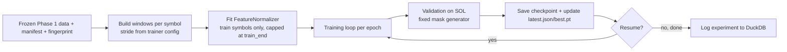

# Training Guide — Teacher Foundation Model (Phase 2)

This guide explains exactly how to train the Phase 2 teacher model: what must
exist first, how the training loop works, how to smoke-test, run, and resume,
and what outputs to expect.



## 1. Prerequisites

Before any training command, the frozen Phase 1 dataset must exist:

- `storage/canonical/futures/{BTCUSDT,ETHUSDT,SOLUSDT}/{klines/1m, funding, open_interest, metadata}/` — the data the trainer reads.
- `storage/training/training_manifest_v1.json` — split + version lock.
- `storage/training/dataset_fingerprint.json` — the data identity.
- `storage/training/index.duckdb` — used by window building (file lookups).

Verify data integrity first:

```bash
python main.py validate
python -m pytest tests/ -v        # 203 tests (verified passing)
```

If data is missing, rebuild it: see `DATA_FLOW.md` §1. If you only have a
subset (e.g. the Colab local copy), see `GPU_TRAINING_GUIDE.md` / `COLAB_GUIDE.md`.

## 2. The training loop, step by step

`src/training/trainer.py::TeacherTrainer` does:

1. **Load the frozen manifest.** `splits.train.symbols = [BTCUSDT, ETHUSDT]`,
   `splits.validation.symbols = [SOLUSDT]`, `time_split.train_end = 2024-11-30`.
2. **Build windows.** For each train symbol, `lake.market_state(symbol) →
   feature_builder.build_features(style) → WindowingEngine(stride)`. Train
   windows are capped at `train_end` (`window_end_ms < train_end_ms`). Val
   windows are unbounded in time (SOL is a held-out symbol).
   - `train_window_stride` / `val_window_stride` (default 16) control density.
     *Implementation note:* the stride is passed directly to `WindowingEngine`,
     so only `N/stride` windows are materialized (RAM-efficient); this differs
     from the Phase 2 plan's "index subsample of stride-1 windows" wording.
   - `max_train_windows` / `max_val_windows` cap via a **seeded** random subset
     (`np.random.default_rng(seed)`, sorted indices) — deterministic per seed.
3. **Fit the normalizer** (default `zscore`) on **train symbols only, capped at
   `train_end`** — never on validation/test. The fitted state is serialized into
   every checkpoint and re-used identically at evaluation.
4. **Build the model** (`TeacherEncoder` from `model_v1.yaml`), AdamW optimizer,
   warmup+cosine scheduler (total steps = `windows//batch_size * epochs`), a
   **train** `MaskGenerator` (seed = run seed) and a **validation**
   `MaskGenerator` (seed = `(run_seed + 10**6) & 0xFFFFFFFF`) so every epoch
   evaluates the *same* mask pattern.
5. **Per step:** normalize batch → mask 15% of valid data positions (never the
   CLS seam) → zero corrupted positions → forward → reconstruction → grouped
   loss → backward → `clip_grad_norm_(1.0)` → AdamW step → scheduler step.
   On CUDA with `mixed_precision: true`: bf16 autocast + `GradScaler`.
6. **Per epoch:** run validation (SOL), track best val loss, save checkpoint.
   `is_best` copies the checkpoint to `best.pt` and points `latest.json` at it.
7. **On completion:** the CLI logs the run to
   `storage/training/experiment_registry.duckdb`.

## 3. Smoke test (CPU, minutes)

Validates the entire loop end-to-end on CPU. Overrides: 2 layers / 4 heads /
`d_model 128` / `d_ff 512`, batch 8, `max_train_windows 256`,
`max_val_windows 64`, 1 epoch.

```bash
python -m src.training.train_teacher --smoke
```

What "success" looks like: `logs/train_teacher.log` shows loss decreasing or
stable, a checkpoint written to
`models/foundation/teacher_v1/<run_id>/`, and `ExperimentRegistry Logged ...`.

## 4. Full training

Requires the data to be present and, for the full 10-epoch run, a CUDA GPU
(see `GPU_TRAINING_GUIDE.md`). Single command:

```bash
python -m src.training.train_teacher \
  --model-config configs/model_v1.yaml \
  --optimizer-config configs/optimizer_v1.yaml \
  --trainer-config configs/trainer_v1.yaml
```

### Returns / span-mask variant (stationary features)

```bash
python -m src.training.train_teacher \
  --model-config configs/model_returns_v1.yaml \
  --optimizer-config configs/optimizer_v1.yaml \
  --trainer-config configs/trainer_returns_v1.yaml
```

This uses `feature_style: returns` (log-return features) and contiguous-span
masking (`mask_mode: span`, `span_len: 16`), with calendar excluded from the
reconstruction target (`reconstruct_calendar: false`).

### Runtime expectations (informational)

Per the Phase 2 plan: ~65 K windows/epoch ≈ 33 M tokens at stride 16; batch 64
⇒ ~1,030 steps/epoch; a single modern GPU → minutes/epoch; 10 epochs under a
few hours. CPU full training is not recommended.

## 5. Resume

```bash
python -m src.training.train_teacher --resume models/foundation/teacher_v1/<run_id>
```

Behavior (important):

- The CLI configs are **ignored** on resume — the run's own
  `manifest.json["configs"]` are authoritative (prevents silent drift).
- `latest.json` decides which checkpoint loads (most recent, or `best.pt` if
  the last save was best).
- Restores model weights, optimizer, scheduler, normalizer, train mask
  generator, and validation mask generator state; training continues at the
  exact `epoch`/`step` recorded.
- Validation keeps using the same deterministic mask pattern (restored state),
  so resumed validation numbers stay comparable.
- If the resume checkpoint fails to load, the trainer **warns and starts
  fresh** (does not crash).

## 6. Checkpoint lifecycle

Per epoch the run dir gets:

```
models/foundation/teacher_v1/<run_id>/
├── checkpoint_epoch1.pt ... checkpoint_epochN.pt   # full state
├── best.pt                                          # copy of best-val epoch
├── latest.json                                      # {"latest": ..., "best": ...}
├── manifest.json                                    # run_id, configs, git_commit, checkpoints[]
└── (history is appended to manifest.json)
```

Full format: `CHECKPOINT_FORMAT.md`. On resume the history is loaded so new
saves append rather than overwrite.

## 7. Logs and monitoring

- Console + `logs/train_teacher.log`: per-`log_every` steps
  `E<epoch> S<step> loss=... lr=... gn=<grad_norm> rss=<RAM>MB`; per-epoch
  train/val loss + per-group breakdown (`price`, `funding_oi`, `calendar`).
- `storage/training/experiment_registry.duckdb`: one row per run (final
  val_loss, versions, seed, metrics).
- Loss curves: `python -m src.evaluation.embedding.visualization --checkpoint <run_dir>`
  renders `evaluation/embedding/figures/loss_curves.png`.

## 8. Expected outputs

| Artifact | Location |
|---|---|
| Checkpoints + manifest | `models/foundation/teacher_v1/<run_id>/` |
| Training log | `logs/train_teacher.log` |
| Experiment registry row | `storage/training/experiment_registry.duckdb` |
| Eval reports + figures | `evaluation/embedding/*.json`, `evaluation/embedding/figures/*.png`, `evaluation/baselines/baseline_eval_*.json` (via eval modules) |
| Eval reports + figures | `evaluation/embedding/*.json`, `evaluation/embedding/figures/*.png` |

## 9. What to watch / common failure signals

| Symptom | Likely cause | Fix |
|---|---|---|
| `RuntimeError: No training windows available` | data/manifest missing or time-split excludes everything | check `storage/`, run `main.py validate` |
| `No validation windows available` | SOL data absent | rebuild/download SOL |
| val loss far above train loss | normalizer/distributional shift or tiny data | expected on held-out SOL at pilot scale; see `MODEL_CARD.md` |
| `Failed to load resume checkpoint` warning | corrupted `.pt` | use a different checkpoint or restart |
| CUDA OOM | batch 64 × 513×512 too large for VRAM | reduce `batch_size` (config), or smoke config |
| Results not reproducible | non-deterministic op / changed data | verify fingerprint + git commit, reseed 42 |

See `TROUBLESHOOTING.md` for the full catalog.

## 10. Full worked example

```bash
# Verify data
python main.py validate

# Smoke the pipeline on CPU
python -m src.training.train_teacher --smoke

# Full run on a CUDA host
python -m src.training.train_teacher \
  --model-config configs/model_v1.yaml \
  --optimizer-config configs/optimizer_v1.yaml \
  --trainer-config configs/trainer_v1.yaml

# If interrupted, resume
python -m src.training.train_teacher --resume models/foundation/teacher_v1/<run_id>

# Evaluate (see EVALUATION_GUIDE.md)
python -m src.evaluation.embedding.clustering --checkpoint models/foundation/teacher_v1/<run_id> --split train --pooling mean
python -m src.evaluation.embedding.linear_probe --checkpoint models/foundation/teacher_v1/<run_id> --pooling mean
```

## 11. Appendix — benchmarking the DataLoader

```bash
python main.py benchmark --symbols BTCUSDT
python -m src.training.benchmark --snapshot 2026-07-30 --symbols BTCUSDT
```
